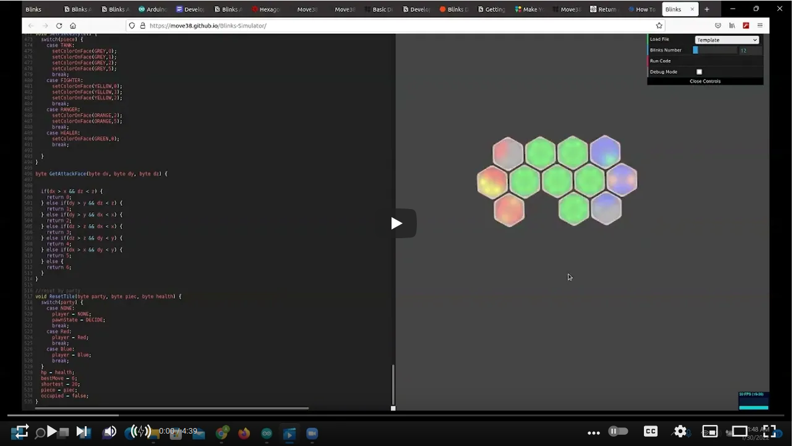

# Repository to hold team Calt's submission for the Move38 2022 game jam.

## Team Members:
- Alexander Qin
- Xiaotian Ma
- Ethan Tabachneck

## Hexachess:

An autochess game that is designed to be played on the Blink systems by Move38.

### Check it out here:

Test it out using the [blinks simulator](https://move38.github.io/Blinks-Simulator/) by copying and pasting in the code found [here](Autobattler/Autobattler.ino).

### Features:

#### Game Setup:
Each game the two players start by claiming and setting the classes of a number of pawns.
The number of pawns each person gets is flexible, but the game works best on a board of 12 blinks with each player having 2-3 pawns.

To claim the blink as a pawn long press it and it will cycle through the avaiable team.
One long press on a blink will change it to the red team and two long presses will change it to the blue team.
Three long presses will return it to not being on a team in case a blink was claimed by accident.

Similarly you can change a pawns class by single clicking it, which will cycle to the next class.

Once the board is setup to start double click the blink closest to the center and the round will begin.

#### Rounds:
Rounds last 15 seconds before they end with all the pawns moving towards the center hex until they encounter an enemy pawn.
Upon encountering an enemy they will attack, dealing damage which shows up as a magenta flash on the piece being hit.

After 15 seconds the round ends and the pieces will stop.
Whoever has the most pieces remaining at the end of the round is the winner.

#### Classes:
Each pawn can be one of four classes: the tank, the melee, the ranger, or the healer.

- The Tank: This pawn is meant to be able to take a lot of hits and has the most health of all the pawns.
To identify a tank look for a pattern of four adjacent grey lights with the remaining two being the color of the team it is on.
- The Melee: This pawn is meant to deal a lot of damage and so it has the highest damage of all the pawns.
To identify a melee look for a pattern of three adjacent yellow lights with the remaining three lights being the color of the team it is on.
- The Ranger: This pawn is meant to be able to deal damage from afar thus has a ranged attack.
To identify a ranger look for a pattern of two orange lights on opposite sides with the remaining four lights being the color of the team it is on.
- The Healer: This pawn is supposed to keep allied pawns alive and does so by healing them.
It is important to note that this is also the only pawn that doesn't deal damage.
To identify a healer look for a single green light with the remaining five lights being the color of the team it is on.

### To Do:
Due to the limited time of the game jam, currently our program only works on the web simulator, wich you can find [here](https://move38.github.io/Blinks-Simulator/).
The next thing to do would be to iron out the glitches that arise from using the hardware.

#### Planned Features:
- Working on hardware
- Smarter pawns
- More time on larger maps

## Further Resources:

- [Devoloper Resources](https://www.notion.so/5d7238314cbe478eb26c08b886dd6045?v=92ffb4fe0d124d39a5eb1a73a2aaf250)
- [General API](https://www.notion.so/Blinks-API-Reference-444f511953bd4619830937fa08bed6ce)
- [Hex Grid Reference](https://math.stackexchange.com/questions/2254655/hexagon-grid-coordinate-system)
